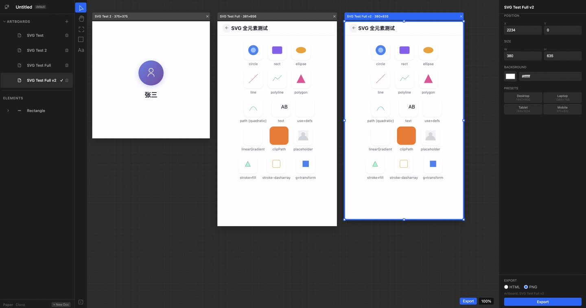

# Paper Clone

A local-first UI design tool that recreates the core Paper experience. It uses real HTML/CSS rendering and MCP so AI agents such as Claude Code can directly read and write the canvas.
---


## Run

### 1. Start the backend (FastAPI + MCP Server)

```bash
cd /Users/teli/www/work/paper_clone_temp/backend
python main.py
```

- Backend URL:`http://127.0.0.1:3004`
- MCP endpoint:`POST http://127.0.0.1:3004/mcp`
- Health check:`GET http://127.0.0.1:3004/health`

### 2. Start the frontend (Vite + React)

```bash
cd /Users/teli/www/work/paper_clone_temp/frontend
npm run dev
```

- Frontend URL:`http://localhost:5175`

### 3. Open the browser

Open http://localhost:5175 in the browser

---

## Claude Code MCP Config

Add the following to the Claude Code MCP config file (usually `~/.claude/settings.json`):

```json
{
  "mcpServers": {
    "paper-clone": {
      "type": "http",
      "url": "http://localhost:3004/mcp"
    }
  }
}
```

> Claude Code will automatically use the `/mcp` `initialize` response to perform the protocol handshake, then call tools over HTTP POST.
> Each MCP call passes `x-paper-doc-id: default` in the request header so the backend can find the matching document.

---

## Architecture

```
┌──────────────────────────────────────────────┐
│  Claude Code / AI Agent                      │
│  (connects via MCP: 127.0.0.1:3004/mcp)     │
└──────────────┬───────────────────────────────┘
               │  HTTP POST (JSON-RPC 2.0)
               ▼
┌──────────────────────────────────────────────┐
│  Python FastAPI Backend (port 3004)          │
│  ├── MCP Server (/mcp)                       │
│  ├── Document Store (in-memory)              │
│  └── HTML Parser                             │
└──────────────┬───────────────────────────────┘
               │  HTTP API + polling sync
               ▼
┌──────────────────────────────────────────────┐
│  React Frontend (Vite, port 5175)            │
│  ├── Canvas (position: absolute + inline)    │
│  ├── Toolbar (Move/Pan/Frame/Rectangle/Text) │
│  ├── Layer Panel (left)                      │
│  ├── Property Panel (right)                  │
│  └── Zustand Store                          │
└──────────────────────────────────────────────┘
```

- **Rendering**: real HTML/CSS DOM, `position: absolute` + inline styles
- **Frontend sync**: the frontend polls the backend every second to pull AI/MCP changes
- **MCP communication**: AI calls a tool → backend handles it → frontend polling syncs the state

---

## MCP Tools (21)

### Document operations
- `get_basic_info` — Get basic document information
- `create_artboard` — Create a new artboard/page
- `delete_artboard` — Delete artboard
- `update_artboard` — Update artboard properties (position, size, name, background color)
- `save_document` — Save document
- `open_document` — Open an HTML file
- `export_html` — Export formatted HTML

### Node queries
- `get_tree_summary` — Get a node tree summary
- `get_children` — Get child nodes
- `get_node_info` — Get detailed node information
- `get_selection` — Get currently selected nodes
- `get_screenshot` — Screenshot data
- `get_computed_styles` — Get computed styles
- `get_jsx` — Export JSX code
- `get_font_family_info` — Get font information

### Node modifications
- `write_html` — Write HTML to create nodes
- `duplicate_nodes` — Duplicate nodes
- `update_styles` — Update styles
- `set_text_content` — Set text content
- `rename_nodes` — Rename nodes
- `delete_nodes` — Delete nodes

---

## Shortcuts

| Shortcut | Function |
|--------|------|
| `V` | Move tool |
| `H` | Pan tool |
| `R` | Rectangle tool |
| `T` | Text tool |
| `F` | Frame tool |
| `Space` + drag | Pan canvas |
| `Cmd + =` / `Cmd + -` | Zoom in / out |
| `Cmd + C` | Copy selected element |
| `Cmd + V` | Paste |
| `Cmd + D` | Duplicate with offset |
| `Delete` / `Backspace` | Delete selected element |
| `Escape` | Deselect |
| `Double-click text elements` | Edit text |

---

## File Structure

```
paper_clone_temp/
├── backend/
│   ├── main.py          # FastAPI entry point + MCP Server (port 3004)
│   ├── document.py      # Document storage
│   ├── parse_html.py    # HTML parser
│   ├── mcp_server.py    # MCP protocol handling
│   ├── mcp_stdio.js     # stdio bridge (used by MCP clients)
│   ├── handlers/
│   │   └── mcp_handler.py
│   └── requirements.txt
├── frontend/
│   ├── src/
│   │   ├── App.tsx
│   │   ├── canvas/
│   │   │   ├── Canvas.tsx
│   │   │   ├── ArtboardFrame.tsx
│   │   │   └── Element.tsx
│   │   ├── toolbar/Toolbar.tsx
│   │   ├── panels/
│   │   │   ├── LayerPanel.tsx
│   │   │   └── PropertyPanel.tsx
│   │   ├── store/
│   │   │   ├── editorStore.ts
│   │   │   └── syncManager.ts
│   │   ├── bridge/api.ts
│   │   └── types.ts
│   ├── index.html
│   ├── vite.config.ts
│   └── package.json
├── desktop/
│   └── main.py          # pywebview desktop entry point (TODO)
└── README.md
```

---

## Development Notes

- **Ports**: backend defaults to `3004`, frontend defaults to `5175`
- **Frontend debugging**: after code changes, Vite HMR updates automatically, so no manual refresh is needed
- **Backend debugging**: after changing Python code, restart the backend manually
- **AI debugging**: before each test, confirm the backend process is running: `lsof -i :3004`
- **Test MCP**: test directly with curl: `curl -X POST http://127.0.0.1:3004/mcp -H "Content-Type: application/json" -d '{"method":"initialize","params":{},"id":1}'`
